# SecOps Pipeline

Kurumsal guvenlik degerlendirmelerini tek bir standartta yurutmek icin tasarlanmis,
moduler ve machine-readable SecOps framework.

## Pipeline

- **Orchestrator Contract:** `pipeline/orchestrator-contract.md`
- **Execution Modes:** `pipeline/modes.md`
- **Quality Gates:** `pipeline/quality-gates.md`
- **Machine-Readable Plan:** `pipeline/orchestrator.manifest.yaml`
- **State Artifacts:** `AUTO_PLAN_STATUS.md`, `PIPELINE_CONTEXT.md`

Zorunlu akis:
- `1 -> 2 -> {3,4,5} -> 6 -> 7`

## Skills

- **Catalog:** `skills/skill-catalog.md`
- **Generic Skill Schema:** `skills/spec-schema.yaml`
- **Class-Based Specs:** `skills/specs/*.spec.md`

Skill seti:
- `/sec-scope`
- `/sec-threat-model`
- `/sec-owasp`
- `/sec-regulatory`
- `/sec-igrc`
- `/sec-risk-report`
- `/sec-signoff`
- `/sec-autoplan`

## Roles

- **Catalog:** `roles/role-catalog.md`

Temel roller:
- Security Orchestrator
- Senior Security Analyst
- Threat Modeler
- AppSec Engineer
- Compliance Officer
- iGRC Analyst
- Risk Officer
- Security Review Board

## Source of Truth

- Master kaynak dokuman: `../resources/claude_pipeline_v1.md`
- Bu klasor (`secops/`) operasyonel ve parcalanmis implementasyon katmanidir.

